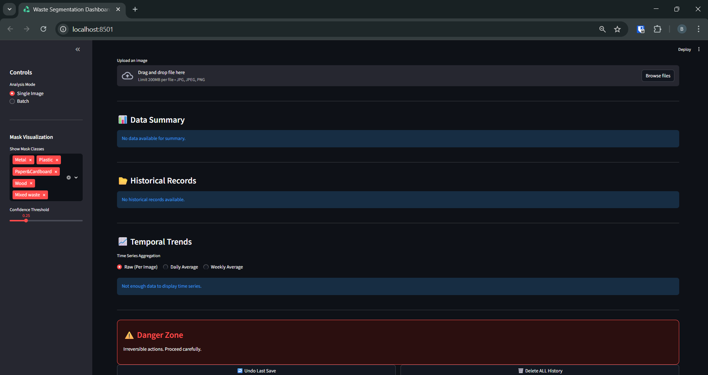
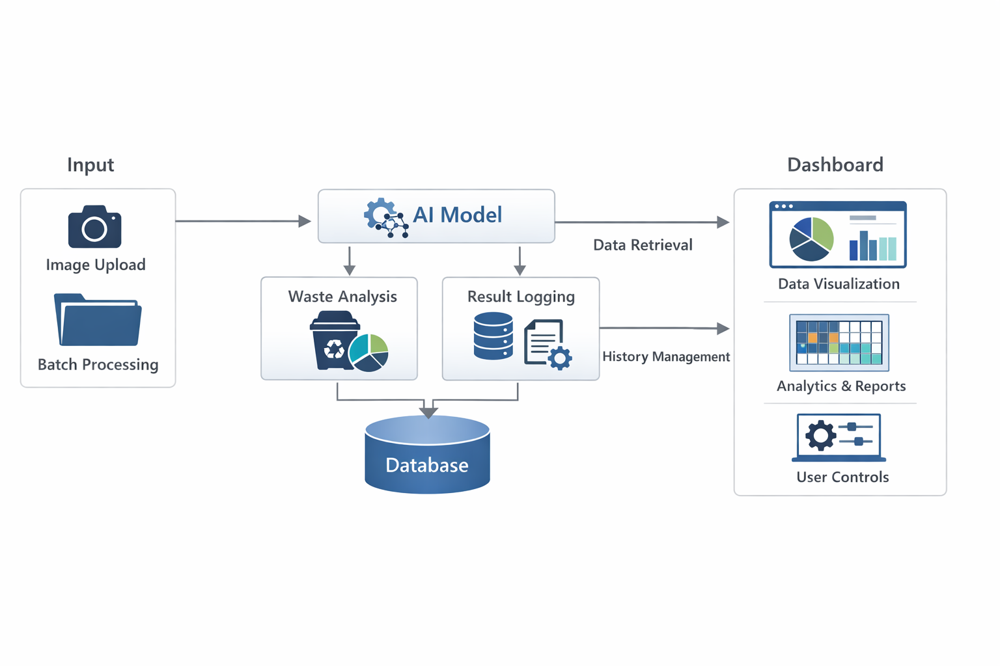
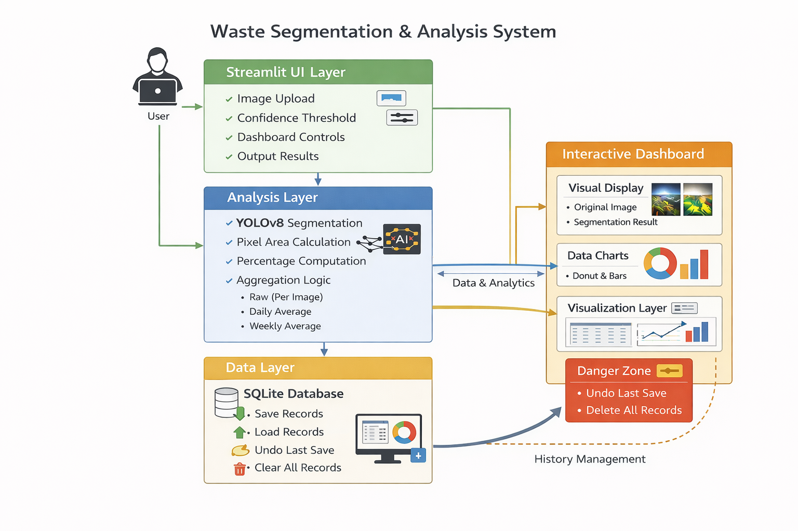
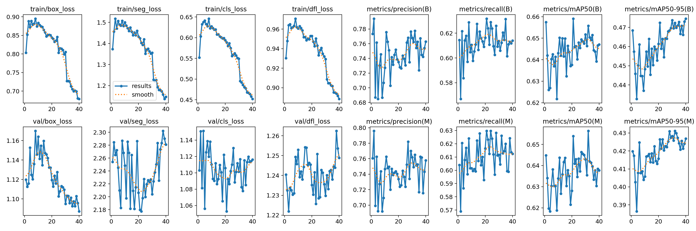
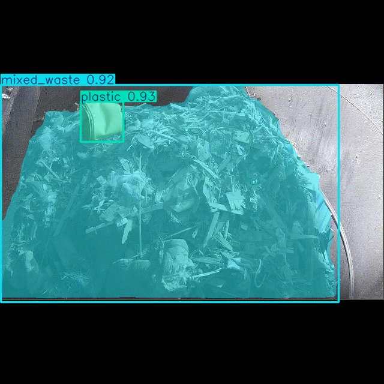
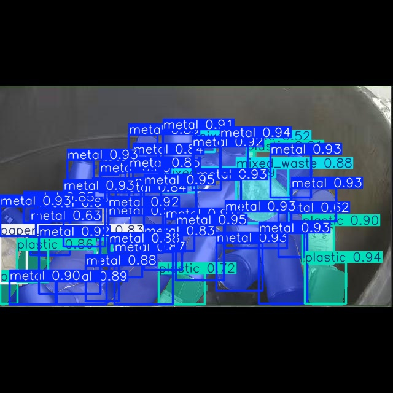
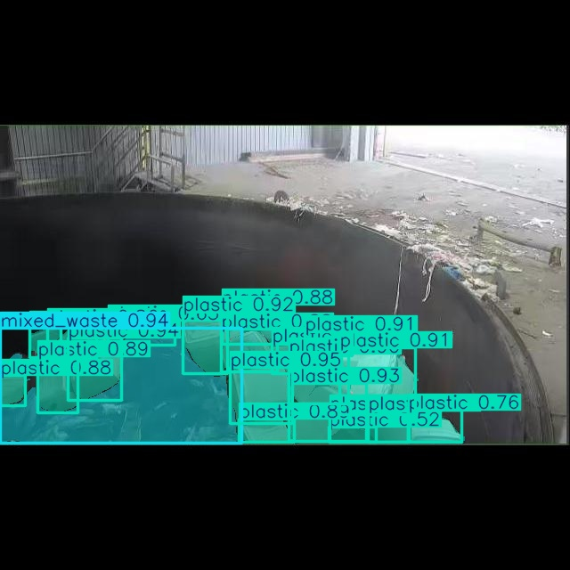
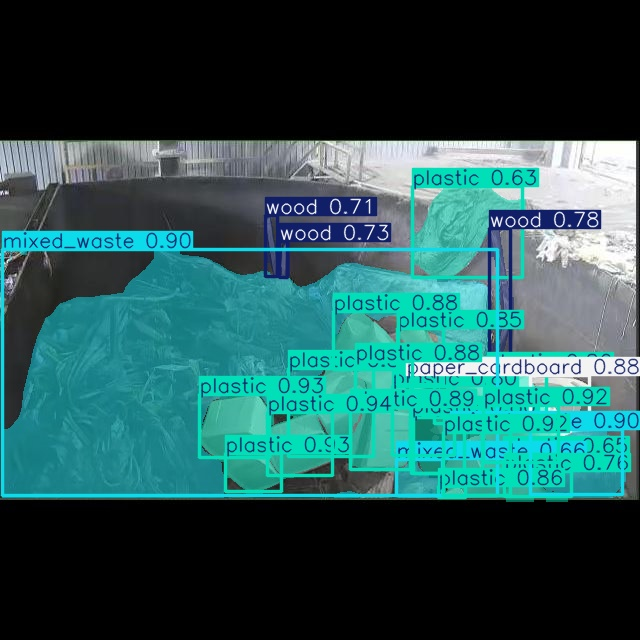
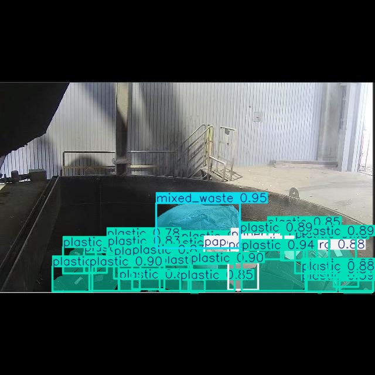

# ♻️ Waste Segmentation & Analysis Dashboard

An AI-powered waste segmentation and analytics dashboard built with **YOLOv8** and **Streamlit** for automated waste composition analysis and historical tracking.

This project demonstrates an AI-powered system for automated waste composition analysis and visualization to support smart waste management.

---

## 🚀 Features

- 🧠 YOLOv8-based waste segmentation
- 📊 Automatic material percentage calculation
- 🖼️ Image upload & batch processing
- 📈 Interactive dashboard visualization
- 🗄️ SQLite database storage
- 📅 Historical record tracking
- ↩️ Undo last save
- 🗑️ Clear database records

---

## 🖥️ Dashboard Preview

Example dashboard interface showing segmentation and analytics results.



---

## 🏗️ System Architecture

Overall interaction between UI, processing pipeline, and database.



---

## 🔄 Processing Pipeline

End-to-end flow from image upload to analytics visualization.



Pipeline steps:

1. Upload image
2. Preprocess image
3. YOLO segmentation inference
4. Pixel area calculation
5. Percentage computation
6. Store results
7. Dashboard visualization

---

## 🧪 Model Training Results

Training performance summary.



---

## 📉 Confusion Matrix

Evaluation performance on validation dataset.


---

## 🖼️ Detection Examples

Example segmentation outputs.

### Example 1


### Example 2


### Example 3


### Example 4


### Example 5


---

## 📂 Project Structure
```
repo/
├── app/                # Core application modules
├── docs/               # Documentation images and diagrams
├── models/             # Trained model weights
├── results/            # Runtime-generated results
├── tests/              # Unit tests
├── main.py             # Streamlit entry point
├── requirements.txt    # Python dependencies
├── README.md
└── .gitignore
```

## ⚙️ Installation

### 1. Clone repository

```bash
git clone <repo_url>
cd waste-segmentation-dashboard
```
### 2. Create virtual environment

```bash
python -m venv .venv
```

### 3. Activate environment

Windows:

```bash
.venv\Scripts\activate
```

Mac/Linux:

```bash
source .venv/bin/activate
```

### 4. Install dependencies

```bash
pip install -r requirements.txt
```

---

## ▶️ Run Application

```bash
streamlit run main.py
```

Then open:

```
http://localhost:8501
```

---

## ⚡ Quick Start

```bash
git clone <repo_url>
cd waste-segmentation-dashboard
python -m venv .venv
.venv\Scripts\activate
pip install -r requirements.txt
streamlit run main.py
```

## 🗄️ Database

SQLite is used for:

* Image analysis history
* Material percentage records
* Timestamp tracking

Database files are automatically generated and excluded from Git.

---

## 📊 Dashboard Capabilities

Dashboard allows:

* Image comparison
* Waste composition visualization
* Historical data tracking
* Daily/weekly statistics
* Data management operations

---

## 🧠 Model Information

| Component | Description                 |
| --------- | --------------------------- |
| Model     | YOLOv8 segmentation         |
| Task      | Waste material segmentation |
| Output    | Pixel mask per material     |
| Metrics   | mAP, Precision, Recall      |

---

## 🔧 Technologies Used

* Python
* Streamlit
* YOLOv8 (Ultralytics)
* PyTorch
* OpenCV
* Plotly
* SQLite

---

## 📌 Future Improvements

* Real-time camera integration
* Cloud deployment
* Multi-site analytics
* IoT integration
* Automatic dataset expansion

---

## 👨‍💻 Author

**Bhumipat Saengduan**

Chiang Mai University – Integrated Engineering

Internship Project

---

## 📄 License

This project is for academic and research purposes.
