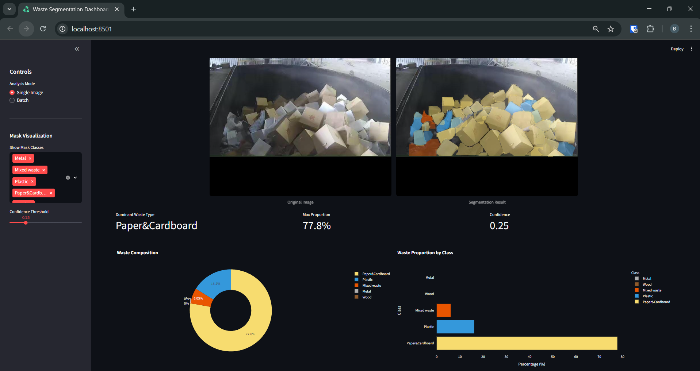
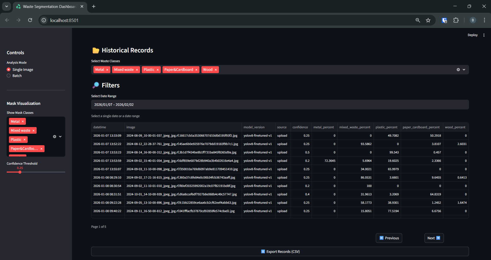
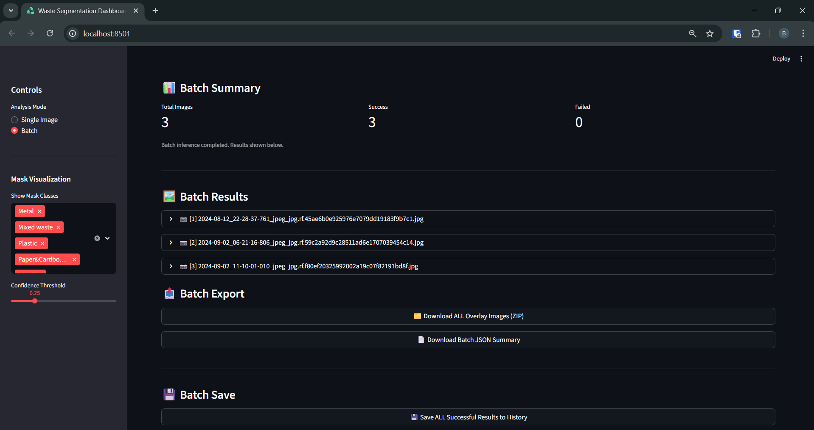
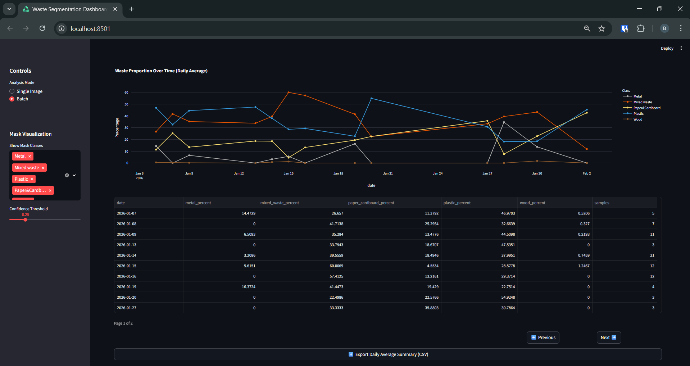

# 📖 Waste Analysis System - User Manual

## 1. Getting Started

### 1.1 System Overview

The Waste Analysis System is a computer vision-based dashboard for analyzing waste composition from images.
It identifies different waste classes such as Metal, Plastic, Paper & Cardboard, Mixed Waste, and Wood, calculates their proportion, and visualizes results through overlay images, charts, and time series.

### 1.2 Dashboard Layout

* **Sidebar**: Controls for analysis mode (Single / Batch), visible mask classes, and confidence threshold.
* **Main Area**: Image preview, mask overlay, composition charts, and results.
* **Tabs / Sections**:
  * Single Image / Batch Analysis
  * Historical Records
  * Temporal Trends
  * Data Summary
  * Danger Zone (Undo / Clear History)

---

## 2. Basic Operations

### 2.1 Upload and Analyze Single Image

1. Select **"Single Image"** mode from the sidebar.
2. Click **"Upload Image"** and select a JPG, JPEG, or PNG file.
3. Wait 2–3 seconds for analysis.
4. Review results:
   * **Overlay Image**: Visual representation of detected waste classes.
   * **Composition Charts**: Donut and horizontal bar charts showing proportions.
   * **Dominant Class**: Highlighted class with the highest proportion.

### 2.2 Adjust Confidence Threshold

* Located in sidebar as a slider (0.05–1.0).
* **Purpose**: Filter detections with low confidence.
* **Tip**: Increase threshold if false positives occur; decrease if some objects are missed.

### 2.3 Save Results to Database

* Click **"💾 Save Result to History"** under analysis results.
* Saved results include: image name, hash, confidence, percentages, and timestamp.
* These will appear in the **Historical Records** section.

### 2.4 View Historical Data

* Navigate to **Historical Records** tab.
* Filter by:
  * **Waste Class**
  * **Date Range**
* Pagination available for large datasets.
* Export filtered records as CSV.

---

## 3. Advanced Features

### 3.1 Batch Processing

1. Switch to **"Batch"** mode.
2. Upload multiple images simultaneously (JPG, JPEG, PNG).
3. Batch processing will analyze images sequentially.
4. Results include:
   * Success / Fail summary
   * Overlay images for each file (downloadable ZIP)
   * JSON summary (downloadable)
5. Save all successful results to history in one click.

### 3.2 Temporal Trend Analysis

* Navigate to **Temporal Trends** tab.
* Aggregation modes:
  * **Raw (Per Image)**: Each point = 1 image
  * **Daily Average**: Mean percentages per day
  * **Weekly Average**: Mean percentages per week
* Select waste class or **All** to visualize trends over time.
* Download summary table as CSV.

### 3.3 Export Data to CSV

* Available in **Historical Records** and **Temporal Trends** sections.
* Export includes all displayed columns, filtered according to your selections.

---

## 4. Troubleshooting

### Common Issues

* **Image upload fails** → Check file type (JPG/PNG) and size (<20MB).
* **Analysis takes too long** → Ensure proper GPU availability or stable internet.
* **Results look wrong** → Adjust confidence threshold or check lighting and image quality.
* **Batch errors** → Check that all files are valid images and within size limit.

---

## 5. Best Practices

* Capture images **directly overhead**.
* Ensure **good lighting**.
* Spread waste evenly for better detection.
* **Review uncertain results manually**.
* Save analysis results frequently to avoid accidental loss.

---

## 6. FAQ

**Q: What file formats are supported?**  
A: JPG, JPEG, PNG

**Q: What is the analysis accuracy?**  
A: 80.9% Box mAP and 77.5% Mask mAP on test dataset.

**Q: Can I hide certain classes in the overlay?**  
A: Yes, select which classes to display in the sidebar under "Show Mask Classes".

**Q: How do I undo accidental saves?**  
A: Use the **"↩️ Undo Last Save"** button in the Danger Zone section.

**Q: How do I clear all history?**  
A: Use the **"🗑️ Delete ALL History"** button in the Danger Zone section.

---

> You can export this manual to PDF with embedded screenshots for offline reference or sharing with users.
